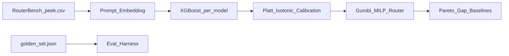

# RouteAlpha

**预算约束下的 LLM 智能路由** — offline predict-then-optimize：预测每条 query 在各模型上的成功率，再用 MILP 在全局预算下最大化期望成功数。

GitHub: https://github.com/pengsihan867-lang/RouteAlpha

---

## 一句话定位

不是「又一个 router demo」，而是强调 **量化级回测纪律 + 概率校准 + 诚实 baseline 对比** 的求职作品集项目。方法论与电力交易中的「XGB 预测 → Gurobi 优化决策」同源。

## 架构



## 快速开始

```bash
git clone https://github.com/pengsihan867-lang/RouteAlpha.git
cd RouteAlpha
pip install -r requirements.txt
python model/ml_seperate.py          # 阶段一: 预测 + 回测
python model/milp.py                 # 阶段二: MILP vs baselines
jupyter notebook test.ipynb          # 完整分阶段 notebook
```

配置见 [`config/config.yaml`](config/config.yaml)。

## 分阶段交付

### 阶段一 · 成功率预测 + 评测

- 每 model 独立 **XGBoost**：`prompt embedding → P(success)`
- **out-of-fold 扩张窗口回测**（特征按折无穿越：TF-IDF 仅 train fit；bge 冻结模型切片）
- 指标：**accuracy / AUC / Brier / ECE**（每 model + overall）
- 产出：`data/predictions.parquet`（含 `p_success_raw` / `p_success_cal`）

### 阶段二 · 校准 + MILP 路由

- **Isotonic/Platt 校准**（fold 内 holdout，ECE ablation）
- **Gurobi MILP**：每条 query 选一个 model，全局成本 ≤ 预算，max Σ p_success
- **MILP 输出**：`assignment` 路由表、`total_cost`、`realized_success_rate`（y_true 诚实评估）
- **深化指标**：Pareto 前沿、optimality gap（vs oracle）、downgrade_failure_rate
- Baseline：always-cheap / always-expensive / random / oracle

## 当前实测（peek 1000 条, TF-IDF, 900 query 测试）

| 阶段 | 指标 | 数值 |
|------|------|------|
| 预测 overall | accuracy / AUC / ECE(raw→cal) | 0.71 / 0.68 / 0.16→**0.07** |
| MILP @0.002/q | 真实成功率 / 成本 | **0.79** / 1.40 |
| always-expensive | 真实成功率 / 成本 | 0.86 / 2.33 |
| oracle 上限 | 真实成功率 | 0.93 |

> 数字随特征/backend/样本量变化；以你本地 `test.ipynb` 跑出为准。

## 项目结构

```
Route Alpha/
├── config/config.yaml       # 数据/模型/embedding/校准/MILP 配置
├── model/ml_seperate.py     # 预测管线 + 校准 + 指标
├── model/milp.py            # MILP 求解 + Pareto + gap
├── eval/golden_set.json     # 黄金标准 held-out audit 集
├── test.ipynb               # 分阶段测试 notebook
├── docs/简历素材.md
├── docs/项目审查报告.md
└── requirements.txt
```

## 数据纪律

- **train / calibration / test / golden** 四路分离（见设计文档）
- TF-IDF：**每 fold 仅在 train 上 fit**（已修复全量 fit 穿越）
- 校准：**fold 内 holdout**，不在 test 上 fit
- `golden_set.json` 不参与训练

## 局限性（诚实披露）

- RouterBench 无时间戳；`shuffle` 后为分块 CV，非金融时序滚动
- 成本视为已知（token×单价）；未建模 latency
- bge-small 对中文 suboptimal；可换 multilingual embedding
- GitHub 仓库需 push 代码后才有可复现链接

## 前端展示建议

- **推荐**：强 README + `test.ipynb` + 导出 PNG（Pareto / reliability diagram）
- **不推荐**：自建 React 前端（ROI 低，面试官更看重数字与纪律）
- **可选 stretch**：Streamlit 预算滑块 demo（非 v1 阻塞）

## License

MIT（建议正式 push 前补充）
