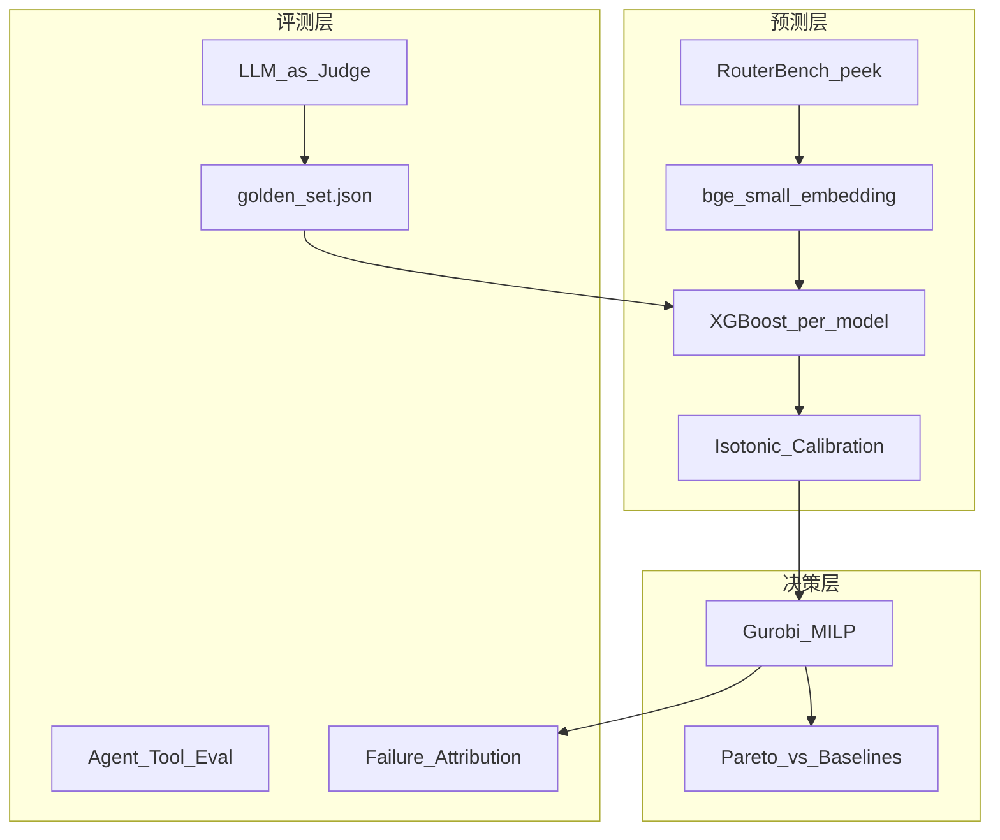
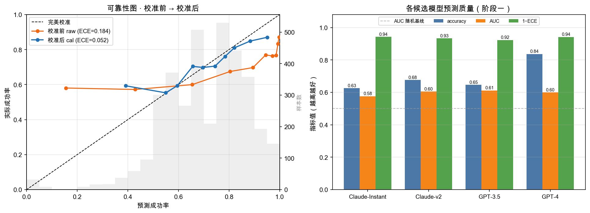
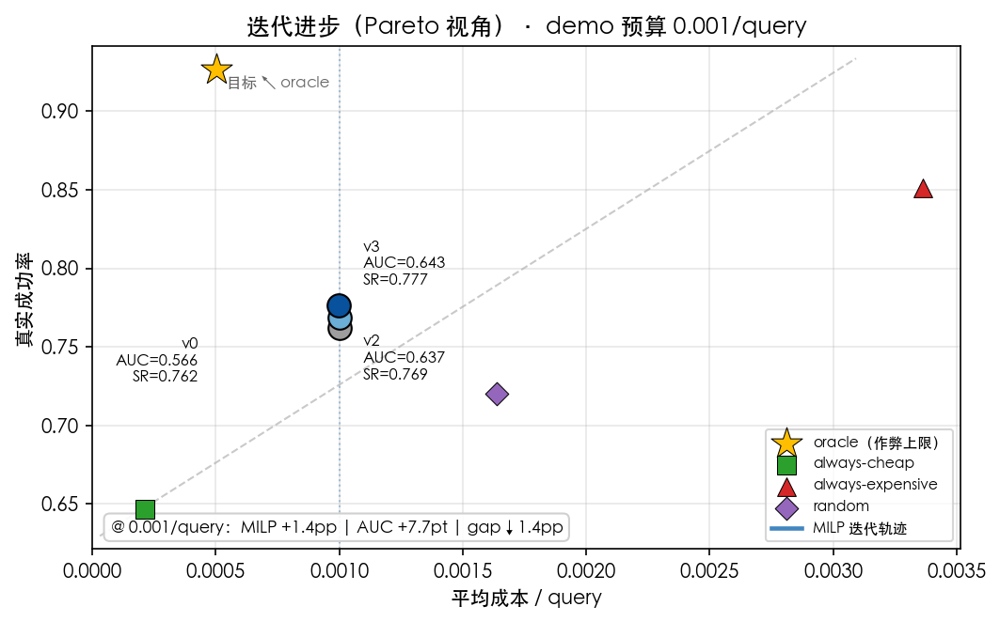
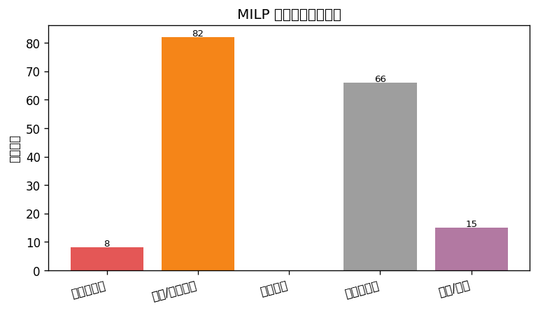

<div align="center">

# RouteAlpha

**预算约束下的 LLM 评测与智能路由**

<p>
  <a href="https://github.com/pengsihan867-lang/RouteAlpha"></a>
  <a href="https://huggingface.co/datasets/withmartian/routerbench"></a>
</p>

</div>

---

**RouteAlpha** 是一个 **predict-then-optimize** 的 LLM 路由系统：先量化评测每条 query 在各模型上的成功率，再在**全局预算硬约束**下用 Gurobi MILP 做最优分配。方法论与电力交易「XGB 预测 → Gurobi 优化申报」同源。

> 我带着**量化交易的回测纪律**做 LLM 评测与路由：out-of-fold 无穿越回测、概率校准（ECE）、诚实 baseline、失败归因；再用 MILP 在预算下最大化成功数。

**目标岗位**：大模型评测 / 模型策略（predict-then-optimize）

---

## 架构



| 层级 | 做什么 | 产出 |
|------|--------|------|
| **预测** | 每 model 独立 XGB + Isotonic 校准 | `data/predictions.parquet` |
| **决策** | MILP 全局预算下 max Σ P(success) | 路由 assignment |
| **评测** | OOF 指标、Pareto、五类 badcase、LLM-judge | `images/*.png`, `eval/*_report.md` |

---

## 关键结果

> 配置：RouterBench peek **1000 条** / **900 query** 测试集（OOF），v3 特征（TE + cross + mglobal）

### 核心数字

| 类别 | 指标 | 数值 |
|------|------|------|
| 预测 overall | AUC | **0.643** |
| 校准 | ECE raw → cal | **0.184 → 0.052** |
| MILP @0.002/q | 真实成功率 / optimality gap | **0.810 / 0.117** |
| MILP @0.001/q (v3) | 真实成功率 | **0.777** |
| oracle 上限 | 真实成功率 | **0.927** |
| 成本对比 | vs always-expensive | **~60% 成本 / ~95% 质量** |
| 失败归因 | 171 条失败 | 校准误导 **82** / 任务难 **66** / 排序错 **8** |

### 阶段一 · 概率校准

左：可靠性图（校准前橙线 vs 校准后蓝线）；右：四候选模型 accuracy / AUC / 1−ECE。

<p align="center">
  
</p>

### 阶段二 · Pareto 迭代进步

固定预算 @0.001/query，v1→v2→v3 在相同成本下成功率从 **0.762 → 0.777** 逼近 oracle。

<p align="center">
  
</p>

| 版本 | 特征 | MILP SR@0.001 | gap |
|------|------|---------------|-----|
| v0 baseline | bge384 + 结构, 无 TE | 0.762 | 0.164 |
| v2 TE only | + Target Encoding | 0.769 | 0.158 |
| v3 TE+cross | + cross difficulty | **0.777** | **0.150** |

### 失败样本归因

<p align="center">
  
</p>

### LLM-as-Judge（Kimi moonshot-v1-8k）

12 对 pairwise（easy 6 + hard 6），swap-and-aggregate 正反各评一次：

| judge | 位置翻转率 ↓ | 采纳率 | 采纳准确率 |
|-------|-------------|--------|------------|
| 公平 mock | 0.083 | 0.917 | 0.818 |
| 有偏置 mock | 1.0 | 0.0 | — |
| **Kimi (real)** | **0.083** | **0.917** | **1.0** |

hard 子集 `hard_random_baseline_length`（长度偏置陷阱）发生位置翻转并被丢弃；其余 11 对一致且均选对。详见 [`eval/kimi_judge_results.json`](eval/kimi_judge_results.json)。

---

## 快速复现

### 1. 环境

```bash
git clone https://github.com/pengsihan867-lang/RouteAlpha.git
cd RouteAlpha
pip install -r requirements.txt
```

### 2. 数据

将 RouterBench peek 子集放到 `data/peek.csv`（不随仓库分发，见 [RouterBench](https://huggingface.co/datasets/withmartian/routerbench)）。

### 3. 一键 Walkthrough

```bash
jupyter notebook test.ipynb
```

notebook 按顺序产出：**阶段一校准图 → 阶段二 Pareto 图 → 失败归因图 → LLM-judge 诊断**，图表自动保存到 `images/`。

### 4. 命令行（可选）

```bash
# 阶段一: OOF 回测 + 校准
python model/ml_seperate.py

# 阶段二: MILP vs baselines
python model/milp.py

# v0 / v2 baseline（供迭代图对比）
python scripts/run_v0_baseline.py
python scripts/run_v2_baseline.py

# 评测模块（默认离线可跑）
python eval/judge.py
python eval/agent_eval.py
python eval/failure_analysis.py

# 单独生成 README 用图
python scripts/plot_calibration.py
python scripts/plot_iteration_progress.py
```

**真实 LLM（可选）**：

```bash
export OPENAI_API_KEY=your_key
export OPENAI_BASE_URL=https://api.moonshot.cn/v1   # Kimi 示例
export JUDGE_MODEL=moonshot-v1-8k
python eval/judge.py --real
```

---

## 项目结构

```
RouteAlpha/
├── test.ipynb              # 分阶段 walkthrough（面试演示入口）
├── config/config.yaml      # 数据 / 特征 / 校准 / MILP 配置
├── model/
│   ├── ml_seperate.py      # OOF 回测 + Isotonic 校准
│   └── milp.py             # Gurobi MILP + Pareto + baselines
├── eval/
│   ├── golden_set.json     # 黄金标准 v1 (48 条, held-out)
│   ├── judge.py            # LLM-as-judge 偏置诊断
│   ├── agent_eval.py       # Agent / 工具调用评测
│   ├── failure_analysis.py # MILP 失败归因
│   └── kimi_judge_results.json
├── scripts/                # baseline 跑法 + 出图脚本
├── images/                 # README / notebook 关键图表
├── docs/实验记录.docx       # 实验目的、迭代、结论
└── requirements.txt
```

---

## 数据纪律（差异化）

- **四分法**：train / calibration / test / golden — golden 永不参与训练
- **防穿越**：TF-IDF 每 fold 仅 train fit；校准在 fold 内 holdout
- **诚实评估**：MILP 真实成功率用 `y_true`，不用预测值自嗨
- **失败归因**：171 条失败逐条打标，定位锅在预测 / 校准 / 预算 / 任务本身

---

## 面试叙事要点

1. **和电价项目同构**：XGB 预测 → Gurobi 约束优化 → 滚动回测评估
2. **校准为什么重要**：ECE 0.184 说明 raw 过度自信，校准后贴对角线，优化器才能正确下注
3. **为什么 MILP 不用贪心**：贪心不能保证全局预算；MILP 给预算确定性
4. **LLM-judge 坑**：位置偏置；swap-and-aggregate 剔除不可信判定
5. **失败归因**：不是只说准确率，能定位 82 条校准误导 vs 8 条排序错

---

## 局限性

- RouterBench 无时间戳；peek 1000 条为演示规模，未上 RouterArena 打榜
- Agent / judge 默认可离线复现；`--real` 需自备 API key
- `data/peek.csv` 与 `predictions.parquet` 需本地生成，不进 git

---

## License

MIT
