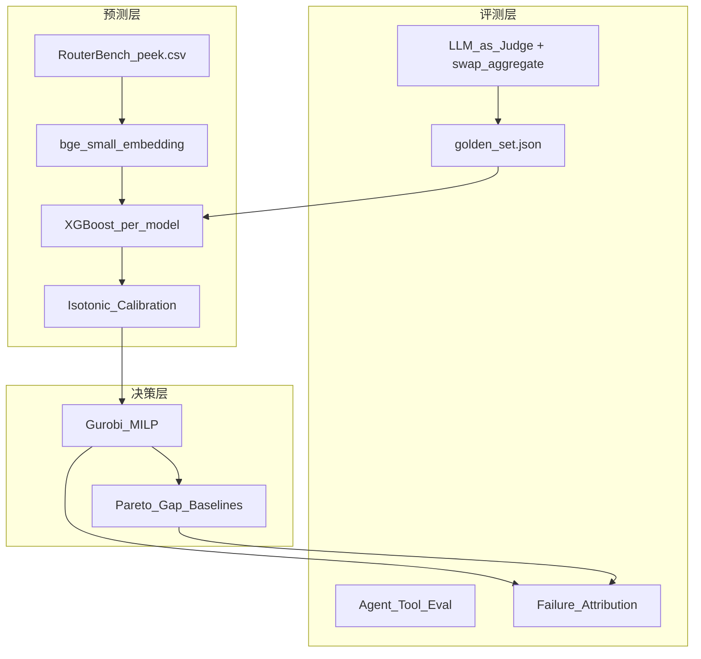
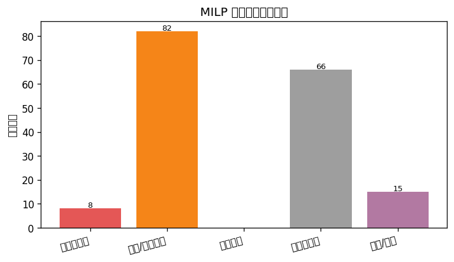

# RouteAlpha

**预算约束下的 LLM 评测与智能路由** — predict-then-optimize：先量化评测每条 query 在各模型上的成功率，再在全局预算下做最优分配。

GitHub: https://github.com/pengsihan867-lang/RouteAlpha

---

## 一句话定位（面试开场）

> 我带着**量化交易的回测纪律**做 LLM 评测与路由：out-of-fold 无穿越回测、概率校准（ECE）、诚实 baseline、失败归因；再用 Gurobi MILP 在预算硬约束下最大化成功数。方法论与电力交易「XGB 预测 → Gurobi 优化申报」同源。

**目标岗位**：大模型评测 / 模型策略（predict-then-optimize）

---

## 架构



---

## 快速复现

```bash
git clone https://github.com/pengsihan867-lang/RouteAlpha.git
cd RouteAlpha
pip install -r requirements.txt

# 1) 准备数据: 将 RouterBench peek 子集放到 data/peek.csv（见下方说明）
python model/ml_seperate.py          # 阶段一: OOF 回测 + 校准 → data/predictions.parquet
python model/milp.py                 # 阶段二: MILP vs baselines（终端对比表）

# 2) 评测模块（默认离线可跑，无需 API key）
python eval/judge.py                 # LLM-as-judge 位置偏置诊断
python eval/agent_eval.py            # Agent / 工具调用评测
python eval/failure_analysis.py    # MILP 失败样本归因

# 3) 完整 walkthrough
jupyter notebook test.ipynb
```

**数据**：`data/peek.csv` 不随仓库分发（体积与 license）。可从 [RouterBench](https://huggingface.co/datasets/withmartian/routerbench) 取子集，或本地已有 peek 文件放入 `data/`。

**真实 LLM（可选）**：

```bash
pip install openai
export OPENAI_API_KEY=your_key
# 可选: export OPENAI_BASE_URL=...  export JUDGE_MODEL=gpt-4o-mini
python eval/judge.py --real
python eval/agent_eval.py --real
```

---

## 分阶段成果（照着讲）

### 阶段一 · 预测器质量 + 概率校准

| 做了什么 | 产出 |
|----------|------|
| 每 model 独立 XGBoost，`bge-small` + 结构特征 | `data/predictions.parquet` |
| 扩张窗口 **out-of-fold** 回测（特征按折无穿越） | accuracy / AUC / Brier / ECE |
| **Isotonic 校准**（fold 内 holdout） | ECE raw **0.184 → cal 0.052** |

左图：可靠性图（校准前橙线 vs 校准后蓝线）；右图：四候选模型 accuracy / AUC / 1−ECE。见 `test.ipynb` 阶段一 1.3。

### 阶段二 · 预算约束路由 + 迭代进步

| 做了什么 | 产出 |
|----------|------|
| Gurobi MILP：全局预算下 max Σ p_success | 路由 assignment |
| vs oracle / always-cheap / expensive / random | Pareto + optimality gap |
| v1→v2→v3 特征迭代 @ 0.001/query | MILP SR **0.762 → 0.777** |

见 `test.ipynb` 阶段二 2.3b 迭代进步图。

### 评测能力（AI 差异化）

| 模块 | 命令 | 面试讲什么 |
|------|------|------------|
| **LLM-as-judge** | `python eval/judge.py` | 位置偏置 + swap-and-aggregate；翻转率/采纳率 |
| **Agent 工具调用** | `python eval/agent_eval.py` | ReAct trajectory；task/tool 成功率 |
| **失败归因** | `python eval/failure_analysis.py` | 171 条失败逐条打标：预测错/校准/预算/任务难 |
| **黄金标准** | `eval/golden_set.json` | 48 条 versioned rubric，held-out 纪律 |



---

## 关键数字（v3 配置, peek 1000 条 / 900 query 测试）

| 类别 | 指标 | 数值 |
|------|------|------|
| 预测 overall | AUC | **0.643** |
| 校准 | ECE raw → cal | **0.184 → 0.052** |
| MILP @0.002/q | 真实成功率 / optimality gap | **0.810 / 0.117** |
| MILP @0.001/q (v3) | 真实成功率 | **0.777** |
| oracle 上限 | 真实成功率 | **0.927** |
| Agent eval (mock) | task_success / tool_success | **1.0 / 1.0** |

> 以本地 `test.ipynb` 与 `eval/*.py` 复跑为准；特征/样本量变化会影响数字。

---

## 项目结构

```
RouteAlpha/
├── config/config.yaml          # 数据/特征/校准/MILP 配置
├── model/
│   ├── ml_seperate.py          # OOF 回测 + 校准 + 指标
│   └── milp.py                 # MILP + Pareto + gap + 降级失败率
├── eval/
│   ├── golden_set.json         # 黄金标准 v1 (48 条)
│   ├── judge.py                # LLM-as-judge 偏置诊断
│   ├── agent_eval.py           # 最小 Agent / 工具调用评测
│   ├── failure_analysis.py     # MILP 失败归因
│   └── *_report.md             # 自动生成的评测报告
├── scripts/                    # v0/v2 baseline & 迭代图脚本
├── test.ipynb                  # 分阶段 walkthrough（面试演示用）
├── docs/                       # 设计文档、迭代日志、图表
└── requirements.txt
```

---

## 数据纪律（差异化，面试必讲）

- **四分法**：train / calibration / test / golden — golden 与 RouterArena 永不参与训练
- **修复特征穿越**：TF-IDF 由全量 fit 改为**每 fold 仅 train fit**
- **校准**：fold 内 holdout，不在 test 上 fit
- **诚实评估**：MILP 用 `y_true` 算真实成功率，不用预测值自嗨

---

## 面试叙事要点

1. **和电价项目同构**：XGB 预测 → Gurobi 约束优化 → 滚动回测评估
2. **校准为什么重要**：优化器用概率下注，ECE 0.184 说明 raw 过度自信，校准后贴对角线
3. **为什么 MILP 不用贪心**：贪心不能保证全局预算；MILP 给预算确定性
4. **LLM-judge 坑**：位置偏置；swap-and-aggregate 剔除不可信判定
5. **失败归因**：不是只说准确率，能定位锅在预测/校准/预算/任务本身

---

## 局限性（诚实披露）

- RouterBench 无时间戳；`shuffle` 后为分块 CV，非金融时序滚动
- peek 1000 条为演示规模；未上 RouterArena 打榜
- Agent / judge 默认可离线复现；`--real` 需自备 API key
- `data/peek.csv` 与 `predictions.parquet` 需本地生成，不进 git

---

## License

MIT
