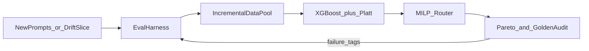

# RouteAlpha 技术背景与设计文档（v2）

> 工作名：**RouteAlpha**（预算约束下的成功率最优策略路由器）。名字可改。
>
> 本文档面向两个读者：(1) 未来的我，用于指导构建；(2) 面试官，用于讲清"为什么做、怎么做、做了有什么好处"。
>
> 标注 `【构建时复核】` 的内容涉及数据集字段、license 等细节，落地前需要在源仓库二次确认，不要直接当成已核实事实写进简历。

---

## 0. 一句话定义

一个 **predict-then-optimize** 的 LLM 策略路由器：**智力内核是对"每条 query 上某模型/某策略能否成功"的量化级严谨评测与预测**，在此基础上于**预算硬约束**下最大化**成功结果数（而非最小化 token）**。

路由是它的应用与变现入口；**评测 + 能力预测**才是它对标"模型策略"岗位的核心。

> 重心共识：**主角是"评测 + 能力预测"，优化器是可靠后端。** 整篇文档围绕这一点。

**主线升级（v2）**：RouteAlpha 不是静态 router demo，而是 **`eval → calibrated prediction → budgeted decision → failure feedback`** 的持续优化闭环——AI 作为长期维护的数字资产，需要可版本化的黄金标准、可审计的标签协议、以及失败驱动的增量迭代（v1 离线闭环优先，线上捕获放 M4/v2）。

---

## 第一部分：为什么要做（WHY）

### 1.1 真实痛点（有数据支撑，可直接进面试）

- **推理成本悖论**：2026 年单价同比降约 67%（三年降上千倍），但企业 AI 总支出**反涨 320%**，**73% 企业超预算**。
- **原因**：Jevons 悖论 + agentic 化。一个 agent 任务触发 10–20 次模型调用，RAG 把上下文撑大 3–5 倍，推理模型烧 10–86 倍 token。Goldman 预测 2030 年 agentic 把 token 消耗推高约 **24 倍**。
- **行业拐点**：评判指标从 **cost per token** 转向 **cost per successful outcome（每个成功结果的成本）**。

> 数据来源为 2026 年多家公开行业分析（Fortune、Goldman、Gartner 等转引），具体引用 `【构建时复核】`。

### 1.2 为什么这是个"深"问题，而不是省钱小工具

"每个成功结果的成本"这个指标，**难点不在除法，在于定义和测量"成功"**——这就是 **eval**。

现有开源路由器（RouteLLM / LLMRouter / best-route-llm / R2-Router）有两个共同盲区：

1. **几乎都是逐条贪心**，**不在全局预算约束下做组合分配**——给不了企业最想要的"预算确定性"；
2. **普遍不严谨评测"质量到底掉没掉"**——而这恰恰是模型策略的命门。

本项目的切入点 = **填这两个盲区**：全局预算约束的组合优化 + 量化级评测严谨度。

### 1.3 为什么是现在（why now）

- 模型动物园爆炸式增长（模型多、策略多、agent 多），**编排/路由问题只会越来越难、越来越值钱**；
- 公共数据（RouterBench / RouterArena）已成熟，**可离线、零成本复现**。

### 1.4 为什么契合"模型策略"岗

模型策略 JD 的核心四件事：**建 eval、数据策略、成本/质量权衡、理解模型行为**。本项目内核逐条命中（见第四部分映射表）。

### 1.5 为什么契合我本人

- `预测 + 约束优化 + 回测` 是我在远景做电力交易那套闭环的**一比一迁移**；
- **不确定性 / 风险刻画**来自量化交易背景；
- 差异化护城河：**懂组合优化的人少做 LLM，做 LLM 的人少懂组合优化**——我正好在交叉点。

---

## 第二部分：做什么（WHAT）

### 2.1 核心科学问题（项目的灵魂）

> 我能否在 query 级别，预测并严谨验证：某个 (模型 × 策略) 组合在这条 query 上"会不会成功"、置信度多少；并据此在预算约束下最大化总成功数？

### 2.2 四层闭环结构

```
                    ┌──────────────────────────────────────┐
                    │  第0层 ★黄金标准 / Eval Harness       │
                    │  versioned golden set + rubric         │
                    │  deterministic scorer / 双 judge 去偏  │
                    └─────────────────┬────────────────────┘
                                      │ 可信 0/1 标签 + 成本
                                      ▼
[一批查询] → 特征化（embedding + 长度/领域/难度）
                    │
                    ▼
              第1层 能力预测器（XGBoost）
              P(success | 模型×策略) + 期望成本
              + 概率校准（Platt / Isotonic, ECE）
                    │
                    ▼
              第2层 组合优化器（OR-Tools MILP）
              max Σ 预测成功数  s.t. Σ 成本 ≤ 预算
                    │
                    ▼
              路由决策：每条 query → 某 (模型, 策略)
                    │
                    ▼
              第3层 ★量化回测引擎
              Pareto / optimality gap / 降级失败率 / ECE
              vs always-cheap/expensive/random/oracle/RouteLLM
                    │
                    ▼
              第4层 失败归因 + 增量闭环（v1 离线模拟，v2 线上）
              badcase → 数据池增量 → 重训 + 重校准 → Pareto 迁移
                    │
                    └──────────► 反馈至第0层（黄金标准迭代）
```

**闭环含义**：没有第 0 层的「什么叫成功」，后面三层全是假决策；没有第 3–4 层的归因与回测，eval 只是摆设。借鉴成熟 eval 工程实践（见 3.9），落到 router 场景，**不声称发明 golden set 或 swap-and-aggregate**。

### 2.3 策略池（补 agent 能力）

路由对象不只是"模型"，而是"**处理策略**"：

| 策略 | 成本 | 适合的 query | 涉及的概念 |
|---|---|---|---|
| 小模型单次回答 | 最低 | 简单分类/抽取 | baseline |
| 大模型单次回答 | 中 | 中等推理 | 模型能力边界 |
| 思维链（CoT） | 中高 | 多步推理 | reasoning token 成本 |
| 工具调用 / ReAct agent | 高 | 需要外部信息/计算 | **tool use / agent loop** |

"在预算内给每条 query 选最划算的策略"——**把 agent 概念自然卷进来**，也让评测更丰富（要评"哪种策略在哪类 query 上才算成功"）。

### 2.4 Agent 评测设计（设计先行，深耕评测方向时实现）

> 动机：评测岗 JD 普遍要求「分析 Agent trajectory、量化工具调用与多步决策的成功率与鲁棒性」（如 JD1 trajectory 分析、蚂蚁 Agentic 动态评估）。当前项目是单步路由，本节把 agent 评测能力补成设计，作为「工具调用 / ReAct」策略分支的评测层，深耕评测方向时再实现。

- **评测对象**：一个最小 ReAct agent（plan-act-observe 循环 + 1–2 个工具，如计算器 / 检索）。
- **trajectory 记录**：每条任务落表 `[task_id, step_idx, thought, action, tool, tool_input, observation, is_terminal]`，便于回放与归因。
- **指标体系**：
  - `task_success_rate`：多步任务最终是否达成目标（用 golden 参考答案判定）。
  - `tool_call_success_rate`：工具调用格式正确且返回有效的比例。
  - `step_efficiency`：完成任务的平均步数 / 是否超过 step 上限。
  - `robustness`：注入工具报错 / 超时后能否恢复（重试、换路径）。
- **失败归因（step-level）**：定位失败发生在 plan（计划错）/ action（工具选错）/ tool（调用格式错）/ observation（误读结果）哪一步，与 3.6 失败归因表对齐。
- **与路由的衔接**：把「是否升级为 agent 策略」纳入 MILP 的策略选项（成本更高但某些 query 才能成功），评测层负责给出各策略的成功率与成本。
- **里程碑**：作为评测方向的增量模块（`【评测深耕】`），**非主线 M1–M3 阻塞项**。

---

## 第三部分：怎么做（HOW）

### 3.1 数据（零成本、离线、可复现）

| 数据 | 用途 | 注意 |
|---|---|---|
| **RouterBench**（`withmartian/routerbench`, HF, 约 40.5 万条推理结果） | **训练**预测器 + **离线回测** | 含 query×模型×是否答对×成本，字段 `【构建时复核】` |
| **RouterArena**（`RouteWorks/RouterArena`, 8.4k 带难度标签 + 标准指标 + leaderboard） | **留出评测** + 打榜 | **明确禁止在其上训练/调参**，只能当 held-out，务必避免泄漏 |

**数据纪律（回测老本行）**：训练只用 RouterBench，RouterArena 永远只做最终留出评测，杜绝 leakage——这本身就是评测严谨度的展示。

**数据切分（四分法）**：

| 切分 | 用途 | 纪律 |
|---|---|---|
| **train** | 训练 XGBoost 预测器 | 不与 golden / RouterArena 重叠 |
| **calibration** | Platt / Isotonic 校准 | 独立 held-out，禁止用 train 做校准 |
| **test** | 离线回测、Pareto、ablation | 调参止步于此之前 |
| **golden** | 自有黄金标准集（`eval/golden_set.json`） | **永不参与训练或调参**；仅用于审计 eval 协议与路由决策质量 |
| **RouterArena** | 最终打榜 | 同 golden，仅 held-out |

### 3.2 黄金标准与评测协议（★项目灵魂，M1 必交付）

> **黄金标准**不是「又多造了一个 benchmark」，而是 **可版本化、可审计、可复现** 的「什么叫成功」协议。借鉴 Promptfoo / DeepEval / llm-evalgate 等成熟实践，落到 RouteAlpha 的 router 场景。

#### 3.2.1 Golden Set 定义

- **载体**：`Route Alpha/eval/golden_set.json`（v1 目标 **50–200 条**，从 RouterBench 按 `eval_name` 分层抽样，人工复核 rubric）。
- **版本化**：每条样本带 `schema_version`；变更 rubric 或 judge 协议时 bump 版本，保留旧版用于回归对比。
- **held-out**：golden 集 **禁止** 进入 train / calibration / test 调参流程；与 RouterArena 同级纪律。

#### 3.2.2 样本字段 Schema（`golden_set.json`）

```json
{
  "schema_version": "1.0",
  "samples": [
    {
      "id": "gsm8k.golden.001",
      "prompt": "...",
      "task_type": "gsm8k",
      "eval_name": "gsm8k",
      "expected_behavior": "numeric_exact_match",
      "rubric": "Extract final numeric answer; match reference with tolerance 0.",
      "success_criteria": "deterministic",
      "scorer": "exact_match",
      "judge_protocol": null,
      "source_split": "routerbench_holdout",
      "reference_answer": "...",
      "failure_tags": [],
      "notes": ""
    }
  ]
}
```

| 字段 | 含义 |
|---|---|
| `id` | 全局唯一，便于 badcase 引用 |
| `prompt` / `task_type` / `eval_name` | 输入与任务类型 |
| `expected_behavior` | 期望行为摘要（给 judge / 人工审计） |
| `rubric` | 可观测评分标准（1–5 句，面试可背） |
| `success_criteria` | `deterministic` \| `llm_judge` |
| `scorer` | `exact_match` / `choice_match` / `code_exec` / `g_eval` 等 |
| `judge_protocol` | 若用 LLM judge：`dual_judge_swap_aggregate` 等 |
| `source_split` | 来源与切分标记 |
| `failure_tags` | 失败归因标签（见 3.6 失败归因表） |

#### 3.2.3 任务类型与 Rubric 优先级

| 任务类型（RouterBench `eval_name` 示例） | 优先 scorer | rubric 要点 |
|---|---|---|
| gsm8k / mbpp 等可验证 | **deterministic**（exact match / 单测） | 不默认上 LLM judge |
| mmlu / hellaswag 等选择 | **choice_match** | 选项字母一致 |
| 开放生成（若扩展） | **llm_judge** + rubric | 必须写清扣分项（啰嗦、离题、幻觉） |

**原则**：能 deterministic 就不 judge；必须 judge 时走 **3.2.4** 去偏协议。

#### 3.2.4 LLM-as-Judge 去偏协议（借鉴 swap-and-aggregate）

借鉴 [judgebias](https://github.com/macamiri/judgebias)、[pairjudge](https://github.com/DaoyuanLi2816/pairjudge)、[llm-evalgate PairwiseJudge](https://github.com/LesterALeong/llm-evalgate)：

1. **双 judge**：两个独立模型（实现可替换，如 Kimi + Fable；v1 可用 Mock 或单一 judge + 文档化协议）。
2. **Swap-and-Aggregate**：同一对输出 (A, B) 正反各评一次；**仅当两次一致** 才采纳 verdict，否则标 `disputed` / `tie`，不进入训练标签。
3. **Bias 诊断**：报告 **position flip rate**（顺序对调后 verdict 翻转比例）；flip rate 过高则该 task 的 judge 标签不可信。
4. **禁止**：在 golden / test 上迭代 judge prompt 调参（防泄漏）。

#### 3.2.5 LLM-as-Judge 落地实现（已实现：`eval/judge.py`）

> 已从"协议设计"升级为"可运行 + 可量化偏置"的最小实现。这是评测岗（Model-based Evaluation / LLM-as-a-judge）的直接命门。

- **输入**：成对的 `(prompt, 好答案, 坏答案)`（演示用内置 6 对；可替换为 golden set 中 `success_criteria=llm_judge` 样本的真实模型输出）。
- **judge 后端**：`make_mock_judge`（离线模拟，可调 `position_bias`）/ `api_judge`（可选真实 API，OpenAI 兼容，默认不调用）。
- **核心流程 swap-and-aggregate**：对同一对答案正反各评一次，**仅两次一致才采纳**，否则判为受位置影响、丢弃。
- **产出指标**：
  - `position_flip_rate` 位置翻转率（越低越好，等于位置偏置大小）；
  - `accept_rate` 采纳率；
  - `accuracy_on_accepted` 采纳样本准确率。
- **实测**：公平 judge 翻转率 0.0 / 采纳率 1.0 / 准确率 1.0；强位置偏置 judge（bias=5）翻转率 1.0 / 采纳率 0.0——直观证明偏置存在且能被识别剔除。
- **交付物**：`eval/judge_report.md`（自动生成）。纪律：judge prompt 只在开发集调，golden / test 冻结，防泄漏。

#### 3.2.6 Eval Harness 职责（M1）

对每条 `(query, model, strategy)` 稳定产出：

- `success`：0/1（经 scorer / judge 协议）
- `cost`：来自 RouterBench 或预估
- `label_confidence`：`high`（双 judge 一致）/ `disputed` / `deterministic`
- 写入 long 表，供预测器与回测消费

#### 3.2.7 持续优化闭环（分阶段）

| 阶段 | 内容 | 何时做 |
|---|---|---|
| **v1（M1–M3）** | RouterBench 离线 + golden v1 + harness；用 **任务切片模拟 drift**（新 `eval_name` 批次 → 增量 CSV → 重训 → 观测 Pareto 迁移） | 求职必达 |
| **v2（M4+）** | 线上捕获新 prompt → 触发自动打标中心 → 增量数据池 → XGBoost + Platt 重训 | 可选 demo；**非 v1 阻塞项** |



### 3.3 技术栈

```
预测器：   XGBoost / LightGBM + scikit-learn（校准）
特征：     小模型 embedding（如 bge-small / Qwen3-0.6B）+ 长度/领域/Bloom 等
优化器：   OR-Tools CP-SAT（免费, 等价 Gurobi）或 PuLP
回测/分析：pandas + numpy + 自写 backtest harness
可视化：   Streamlit（交互式帕累托前沿 / 预算滑块，备选加分项）
线上 Demo：OpenRouter / GLM（便宜，仅 demo 用，可 Mock）
```

### 3.4 能力预测器（第 1 层）

- 输入：query 特征（本地 embedding + 长度 + 领域 + 难度信号）。
- 输出：对每个 (模型 × 策略)，预测 `P(success)` 与 `expected_cost`。
- **关键差异化**：**概率校准**（Platt / Isotonic）+ 报告 **ECE**。优化器要用这个概率做决策，**校准不准 = 决策不可信**——对应量化里"预测要可信才能拿来下注"的思维。

### 3.5 组合优化器（第 2 层，舒适区，做扎实但别过度投入）

数学形式（多选背包 / 指派型 0-1 MILP）：

```
变量：   x[q, m, s] ∈ {0,1}   （query q 是否走 模型 m × 策略 s）
约束1：  ∀q  Σ_{m,s} x[q,m,s] = 1            （每条 query 恰好选一个）
约束2：  Σ_{q,m,s} cost[q,m,s]·x ≤ Budget     （全局预算硬约束）
目标：   max Σ_{q,m,s} p_success[q,m,s]·x     （最大化期望成功数）
进阶：   目标加 -λ·Var(预测)  → 风险调整路由（量化加分）
```

**为什么用 MILP 而非贪心**（面试必问）：贪心逐条最优**不能保证全局预算**；MILP 能给"总花费 ≤ 预算下的全局最优"，**这正是企业要的"预算确定性"**。

### 3.6 量化回测引擎（第 3 层，★项目真正的深度与差异化）

- **基线对比**：always-cheap / always-expensive / 随机 / 贪心 / RouteLLM。
- **核心图**：**帕累托前沿**（质量 vs 成本）——证明同等成本下质量更高，或同等质量下更省。
- **指标**：固定预算下成功率、固定质量下成本、**对 oracle 的 optimality gap**、**降级失败率**（路由到次优模型导致的失败占比）、**校准度 ECE**、鲁棒性。
- **风险视角**（量化味）：不仅报均值，报**最坏情况 / 方差**。
- **打榜**：提交 RouterArena，拿**可验证的排名 / 数字**写进简历。

> **当前实测**（口径见 4.1）：固定预算 0.002/query 下 MILP 真实成功率 0.79，约 always-expensive 60% 成本达其 92% 质量，oracle 上限 0.93；校准使 overall ECE 0.194 → 0.072。两处数字须保持一致，更新时同步改 4.1 与本节。

**失败归因（badcase / failure attribution）**——每条 golden 或 test 失败样本归类：

| 归因类型 | 含义 | 后续动作 |
|---|---|---|
| `label_noise` | judge 偏见 / disputed 标签污染 | 收紧 judge 协议或剔除 disputed |
| `prediction_error` | P(success) 排序错 | 补特征 / 数据 |
| `calibration_error` | 排序对但概率不可信，导致 MILP 误分配 | 校准集独立、报告 ECE ablation |
| `budget_binding` | 预算太紧，被迫选便宜模型失败 | 调预算曲线 / Pareto 解读 |
| `task_hard` | oracle 也失败 | 记入能力边界分析，非路由锅 |

**进阶 Ablation（M2–M3，简历加分）**：

1. **Calibration ablation**：同一 MILP，未校准 vs 校准后概率 → Pareto 曲线对比。
2. **Label-quality ablation**：naive judge vs swap-and-aggregate 标签 → 预测器 AUC / 路由 success rate 对比。
3. **（可选）Light robust routing**：用 `p_lower`（保守估计）喂 MILP，观察预算紧时 success 是否更稳——引用 batch-level robust routing 思路即可，不必复现全文。

### 3.7 构建里程碑（2–3 周，先冷硬核闭环，再加料）

| 周 | 里程碑 | 产出 |
|---|---|---|
| M1 | 数据管线 + 基线 + **黄金标准 v1** + **eval harness** | `golden_set.json` schema + 50–200 条样本；long 表；四条 baseline 图 |
| M2 | XGBoost 能力预测器 + **校准** | ECE / reliability diagram；calibration ablation |
| M3 | MILP 优化器 + **帕累托前沿回测** + **失败归因表** | optimality gap；label-quality ablation |
| M4 | RouterArena 打榜 + README +（可选）drift 切片模拟增量闭环 + Streamlit | v2 线上捕获 **非阻塞** |

**纪律**：M1–M3 是必做硬核；M4 可视化与线上闭环是加分，别提前。守住"先闭环，再有趣"。

### 3.8 站在哪些开源肩上——路由与数据（不造轮子）

- `RouteLLM`（参考实现 + baseline）
- `ulab-uiuc/LLMRouter`（16 种路由器，抄思路 / 当对照）
- `microsoft/best-route-llm`（质量-成本 trade-off 实现）
- `withmartian/routerbench` + `RouteWorks/RouterArena`（数据 + 评测框架）

**原创部分（执行质量，非算法首发）**：全局预算 MILP + **黄金标准协议** + 量化级回测/校准/失败归因 + 策略级路由。区分度在 **eval 纪律与可复现数字**，不在声称发明新 router。

### 3.9 评测 / 黄金标准借鉴来源（准则抽取，v1 微调自用）

> 以下项目 **不整包依赖**；只抽取与 RouteAlpha 匹配的工程准则，写入 `golden_set` 与 harness 设计。

| 开源项目 | 借鉴什么 | RouteAlpha 落点 |
|---|---|---|
| [promptfoo/promptfoo](https://github.com/promptfoo/promptfoo) | 声明式 eval、回归测试、CI 门禁、多模型横向比较 | golden set 版本化 + 变更回归；README 可附 promptfoo 风格用例表 `【可选】` |
| [confident-ai/deepeval](https://github.com/confident-ai/deepeval) | Pytest 式 LLM 单测、G-Eval / task completion metric 组织 | harness 按 metric 模块化；开放任务用 G-Eval 式 rubric |
| [EleutherAI/lm-evaluation-harness](https://github.com/EleutherAI/lm-evaluation-harness) | 研究级 task adapter、metric 标准化、可复现 benchmark | **基座模型选型**参考，**不**直接当应用 golden set |
| [LesterALeong/llm-evalgate](https://github.com/LesterALeong/llm-evalgate) | deterministic gate + LLM judge、置信区间、PairwiseJudge order-swap | harness：先 deterministic gate，再 judge；`consistent=False` → disputed |
| [macamiri/judgebias](https://github.com/macamiri/judgebias) | position / length bias 效应量、swap_and_judge 工作流 | 报告 position flip rate；CI 外才算显著偏见 `【可选】` |
| [DaoyuanLi2816/pairjudge](https://github.com/DaoyuanLi2816/pairjudge) | swap_debias、position_flip_rate | 双序评测与 flip rate 指标命名对齐 |
| RouterBench 原论文 / 仓库 | query×model×success×cost 宽表 | 训练与回测主数据；标签质量以自有 golden 审计 |

**v1 微调清单（你自己改）**：

1. 从 RouterBench 按 `eval_name` 分层抽 golden 候选 → 填 `golden_set.json`。
2. 为每类任务写 1 段 rubric（可先抄 lm-eval task 说明再缩短）。
3. 定双 judge 实现（API 或离线 Mock），写进 `judge_protocol` 字段。
4. 跑 position flip rate 试点（小样本即可），决定 disputed 比例阈值。

---

## 第四部分：做了有什么好处（BENEFITS）

### 4.1 简历上的一句话

> 定义 task-level **黄金评测标准**（versioned golden set + 双 judge swap-and-aggregate 协议），构建 offline eval harness；在 RouterBench 上训练 **校准化** query 级成功率预测器，用 MILP 在**全局预算硬约束**下最大化成功结果数；以 **Pareto 前沿、optimality gap、降级失败率、ECE ablation** 与 **badcase 归因** 验证决策链路，RouterArena held-out **第 N 名**。

（N 待打榜结果填入。）

**当前离线实测快照**（口径：peek.csv 1000 条 / 900 query 测试，TF-IDF 特征 + 扩张窗口 out-of-fold，已修复特征穿越）：

- 预测器 overall：accuracy 0.698 / AUC 0.555 / Brier 0.214；gpt-4 专属 accuracy 0.851。
- 概率校准（Isotonic）：overall **ECE 0.194 → 0.072**。
- 路由（固定预算 0.002/query）：MILP 真实成功率 **0.79**；always-expensive 0.86（成本 2.33），MILP 以约 **60%** 成本达到其 **92%** 质量；oracle 上限 0.93。
- LLM-judge 偏置诊断（`eval/judge.py`）：演示集上公平 judge 位置翻转率 0.0 / 采纳率 1.0，强位置偏置 judge 翻转率 1.0 / 采纳率 0.0，验证 swap-and-aggregate 能识别并剔除受顺序影响的判定。

> 数字随特征（TF-IDF → bge-small）、样本量与校准方法变化；以仓库 `test.ipynb` 与 `eval/judge.py` 复跑为准。

### 4.2 每个组件向面试官证明了什么（评测岗 + 模型策略岗 双映射）

> 一份项目两类岗通吃：左侧组件，中列对**模型评测岗**的证明，右列对**模型策略岗**的证明。

| 项目组件 | 命中的「模型评测岗」能力 | 命中的「模型策略岗」能力 |
|---|---|---|
| **黄金标准** + eval harness + judge 去偏协议 | 黄金标准 / 多维评测体系 / 定义成功（岗位命门） | 建 eval / 定义成功 |
| golden held-out + 四分法切分 + RouterArena 纪律 | 数据污染防范 / 评测可信度 | 数据策略 / 防泄漏 |
| **out-of-fold 无穿越回测**（修复 TF-IDF 全量 fit 穿越） | 评测严谨度 / 防止指标虚高 | 科学的回测纪律 |
| **LLM-as-judge swap-and-aggregate** + position flip rate（`eval/judge.py`） | **Model-based Eval / judge 偏置量化**（JD 命门） | 标签质量 → 训练数据可信 |
| Agent 评测设计（trajectory / 工具调用成功率，见 2.4） | **Agentic 动态评估 / 失败模式分析** | 策略路由的 agent 分支 |
| 评测 harness + 帕累托 / 校准 / optimality gap | 指标体系 / Leaderboard / badcase 驱动迭代 | 成本-质量权衡分析 |
| query 级成功率预测 + **失败归因表** | 失败模式定量分析 / 瓶颈定位 | 理解模型能力边界与行为 |
| 成本 / 质量 / 预算约束 | cost-per-outcome 评测口径 | 推理成本意识、predict-then-optimize |
| calibration ablation + label-quality ablation | 校准评估 / 消融实验设计 | 概率可信 → 决策可信 |
| MILP + 风险调整 | （决策层，评测岗为加分） | **predict-then-optimize**（护城河） |
| drift 切片模拟增量闭环 `【M4】` | 评测体系持续演进 | AI 作为长期维护资产的运维思维 |

### 4.3 三个"不像玩具"的硬证据

- **可验证**：榜单数字 + clone 即复现 + golden set 可审计；
- **真痛点**：企业账单在爆炸；cost per successful outcome；
- **有区分度**：跨领域量化严谨度 + **自有黄金标准协议**（非空口「我做了 eval」）。

---

## 附：与最初想法的关系（留痕，面试可讲产品演进）

最初想法是"AI 转型陪学 agent"。经过对市场（模型策略 vs AI 产品泡沫）、目标用户付费意愿、自身能力 gap 的反复论证，主动放弃了浅层 prompt 套壳方向，收敛到"用量化方法做 LLM 评测与资源最优分配"。

**这个演进过程本身（定义问题→证伪→收敛）就是产品判断力的证据，值得在面试中讲。**
